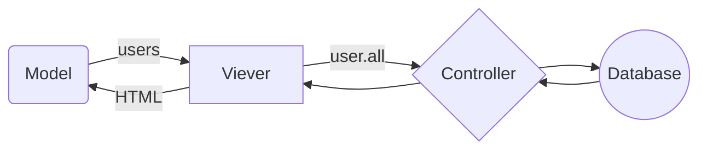

# README

## Sample application 

Model - Viewer - Controller  

# Chapter 3  

### common commands  

* rails db:migrate  

* rails test  

* rails server  


## Controller excercises  

* rails generate controller Foo bar baz  

* rails destroy controller Foo bar baz  

## New dynamic page excercise  

* Added Contact page successfully

## Changing root page  

* Changed root, done testing, works fine

## Issues
  ```bash
  assert_select: command not found 
  ```
  -> problem solved

# Chapter 4  

## Notebook  

* "" suports interpolation in strings, when '' dont  

## String excercises  

* ex1
  ``` ruby
  city = "krakow"  
  state = "malopolska"  
  ```
* ex2
  ``` ruby
  "#{city}, #{state}"  ->  "krakow, malopolska"
  ```

* ex3
  ``` ruby 
  "#{city}, #{state}"    
  ```
  (no diffrence between them)
* ex4
  ``` ruby
  '#{city}, #{state}' 
  ```
  ``` bash
  ->  "\#{city}, \#{state}"
  ```
## Objects and message passing excercises  

* ex1
  ``` ruby
  "racecar".length -> 7    
  ```
  ``` bash
    -> 7
  ```
* ex2
    ``` ruby  
    !!"racecar".reverse  
    ```  
    ``` bash
    -> "true"
    ```
* ex3
  ``` ruby  
  s = "racecar"  
  s == s.reverse ? "they are the same" : "kinda diffrent tho"  
  ```
  ``` bash
  -> "they are the same"  
  ```
* ex 4
  ``` ruby  
  s = "onomatopeja"  
  s == s.reverse ? "they are the same" : "kinda diffrent tho"  
  ```
  ``` bash  
  -> "kinda diffrent tho"  
  ```  
## Method definitions excercises  

* ex1  
  palindrome testing
    ```ruby  
    def palindrome_tester(s)  
        if s == s.reverse  
            puts "it's a palindrome!"  
        else
            puts "it's not a palindrome!"  
        end  
    end 
    ```
    ``` bash 
    >> palindrome_tester("kajak")  
    it's a palindrome!  
    => nil  
    
    >> palindrome_tester("kajaki")  
    it's not a palindrome!  
    => nil  
    ```
* ex2   
  Confirmed by puting "kajak" and "kajaki" in tester  

* ex3  
    ``` bash
    palindrome_tester("kajaki").nil?  
    it's not a palindrome!  
    => true  
    ```
## Other data structures  
### Arrays  

* ex1
  ``` bash
  a = "A man, a plan, a canal, Panama".split(', ')  
  a  
  => ["A man", "a plan", "a canal", "Panama"]  
  ```
* ex2
  ``` bash  
  s = a.join  
  s
  => "A mana plana canalPanama"  
  ```
* ex3  
  ``` bash
  spl = s.split(' ').join  
  spl  
  => "AmanaplanacanalPanama"  
  palindrome_tester(spl)  
  => it's not a palindrome!  
  palindrome_tester(spl.downcase)  
  =>it's a palindrome!  
  ``` 
* ex4
  ``` bash
  b = ("a".."z").to_a  
  b[7]  
  => "h"
  b[-7]  
  => "t"  
  ```
### Blocks  

* ex1  
  ``` ruby
  (0..16).each do |i|     
    puts "kwadratem liczby #{i} jest #{i**2}"  
  end 
   ```
  
  -> works fine, but output is kinda long, so i dont put it here  

* ex2  
    ``` ruby  
    def yaller(arr)  
       upc = arr.map{ |i| i.upcase}  
       puts upc.join  
    end 
    ``` 
    ``` bash
    -> yaller(['o','l','d'])`  
    OLD  
    ```  
* ex3  
  ``` ruby 
  def random_subdomain  
    letters = ('a'..'z').to_a  
    sub_dom = (0..7).map {letters[rand(7)]}  
    puts sub_dom.join  
  end
  ```  
    ``` bash  
    random_subdomain  
    fgbdadcd  
    => nil  
    ```
* ex4
    ``` ruby
    def string_shuffle(s)  
        s.split('').shuffle.join    
      end  
      string_shuffle("foobar")  
    ```
    ``` bash
    string_shuffle("foobar")    
    => "oofrab"  
    ```

### Hashes and symbols  

* ex1
  ``` ruby
  lang = { one: "uno", two: "dos", tree: "tres" }   
  lang.each do |eng,esp|  
    puts "#{eng} in spanish is #{esp}"  
  end  
  ```
  ``` bash
  one in spanish is uno  
  two in spanish is dos  
  tree in spanish is tres  
  => {:one=>"uno", :two=>"dos", :tree=>"tres"}  
  ```
* ex2
  ``` ruby 
  person = {} 
  params = {} 
  person[:person1] = { frst: "name1", last: "last1" }  
  person[:person2] = { frst: "name2", last: "last2" }  
  person[:person3] = { frst: "name3", last: "last3" }  
  params[:father] = person[:person1]  
  params[:mother] = person[:person2]  
  params[:child] = person[:person3]  
  params[:father][:frst]  
  ``` 
  ``` bash
  => "name1"  
  ```
* ex3
  ``` ruby
  def random_pswd(lngth)  
    letters = ('a'..'z').to_a  
    pswd = (0..lngth).map {letters[rand(lngth)]}  
    return pswd.join  
  end   
  user = { name: "Kamil", email: "random@random.com", password: random_pswd(15) }  
  puts "#{user[:name]} ,#{user[:email]} ,#{user[:password]}"  
  ```
  ``` bash  
  Kamil ,random@random.com ,hmbhmnhffbgeiblm  
  => nil  
  ```
* ex4
  ``` ruby
  Returns a new ActionController::Parameters with all keys from other_hash merged into current hash.  
  {"a"=>100,"b"=>200}.merge({"b"=>300}) changes "b" in first hash to 300, so output is: "a"=100, "b"=300  
  ```
  
### Classes  

#### Constructors  

* `(1..10)` -> literal constructor, range constructor is just Range(1,10)  

* `c = Range.new(1,10)`  where 1 is starting point and 10 is end point  

* `(1..10)` -> literal constructor , `Range.new(1,10)` -> named constructor  
`(1..10) == Range.new(1,10)`
  ``` bash
  => true 
  ```

#### Inheritance  

* Inheritance hierarchy for:  
- Range - Object - Basic Object  
- Hash - Object - Basic Object  
- Symbol - object - Basic Object  

* ex1
  ``` ruby 
  class Word < String  
    def palindrome?  
      self == reverse  
    end  
  end  
  ```
  ``` bash
  s = Word.new("level")  
  s.palindrome?  
  => true  
  ```
#### Modyfing built-in classes  

* ex2
  ``` ruby
  class String  
    def palindrome?  
      self == self.reverse  
    end  
  end
  ```
  ``` bash  
  "racecar".palindrome?  
  => true  
  "onomatopeia".palindrome?  
  => false  
  "Malayalam".downcase.palindrome?  
  => true  
  ```
* ex3
  ```ruby
  class String  
    def shuffle  
      self.split('').shuffle.join    
    end  
  end
  ```
  ``` bash  
  "majo".shuffle
  => "amjo"
  ```
  
* ex4
  ``` ruby
  class String  
    def shuffle  
      split('').shuffle.join    
    end  
  end
  ```
  ``` bash  
  "majo".shuffle  
  => "oajm"  
  ````
#### Controller Class

* ex1
  ``` bash
  user = User.new  
  user.class  
  => User(id: integer, name: string, email: string, created_at: datetime, updated_at: datetime)  
  ```
  
* ex2
  ``` bash
  hierarchy  
  user - ApplicationRecord - ActiveRecord::Base - Object  
  ```
  
#### User Class  

* ex1
  ``` ruby
  class User  
    attr_accessor :first, :last, :email  
    
    def initialize(attributes = {})
      @first = attributes[:first]  
      @last = attributes[:last]   
      @email = attributes[:email]   
    end  
    
    def formated_email  
      "#{@first} #{last} <#{email}> "  
    end  
  end
  ```
  ``` bash         
  user = User.new(first: "Kamil", last: "Wlcz", email: "rand@rand.com")  
  user.formated_email  
  => "Kamil Wlcz <rand@rand.com> "  
  ```
  
* ex2
  ``` ruby
  class User  
    attr_accessor :first, :last, :email  
    
    def initialize(attributes = {})
      @first = attributes[:first]  
      @last = attributes[:last]   
      @email = attributes[:email]   
    end  
    
    def formated_email  
      "#{@first} #{last} <#{email}> "  
    end  
    
    def alph_name  
      "#{@first}_#{@last}"  
    end  
  end
  ```
  ``` bash
  user = User.new(first: "Kamil", last: "Wlcz", email: "rand@rand.com")  
  user.alph_name      
  => "Kamil_Wlcz"  
  ```
  
* ex3
  ``` ruby
  class User  
    attr_accessor :first, :last, :email  
    
    def initialize(attributes = {})
      @first = attributes[:first]  
      @last = attributes[:last]   
      @email = attributes[:email]   
    end  
    
    def formated_email  
      "#{@first} #{last} <#{email}> "  
    end  
    
    def alph_name  
      "#{@first}_#{@last}"  
    end  
    
    def full_name  
      split('_')  
    end  
  end
  ```
  ``` bash
  user = User.new(first: "Kamil", last: "Wlcz", email: "rand@rand.com")  
  user.alph_name.full_name
  ```
## Chapter 5  

### Integration test  

* ex1  
  after changing about_path to contact_path in _footer partial, integration test has catched this   problem.  
  
* ex2  
  ASK RADEK! or check it when rested.  (page 282)
  edit: understood.
  

## Chapter 6   

### new user exercises  

* ex1  
  ```bash
  User.new.class
  => User(id: integer, name: string, email: string, created_at: datetime, updated_at: datetime)
  User.new.class.superclass
  => ApplicationRecord(abstract)
  ```

* ex2  
  ```ruby
  class ApplicationRecord < ActiveRecord::Base
  .
  .
  .
  ```

### User object  

* ex1  
  ```bash
  foo.name.class
  => String
  foo.email.class
  => String
  ```

* ex2   
  ```bash
  foo.updated_at.class
  => NilClass
  foo.created_at.class
  => NilClass
  ```
  
### Finding user objects  

* ex1 - Find the user byname. Confirm thatfind_by_nameworks as well.
  ```bash
  User.find_by(name:ble)
  => #<User id: 1, name: "ble", email: "bl@bl.com", created_at: "2021-03-11 18:17:02.482912000     +0000", updated_at: "2021-03-11 18:17:02.482912000 +0000">
  User.find_by_name(ble)==User.find_by(name:ble)
  => true
  ```
  
* ex2 - User.allacts like an array, but confirmthat in fact it’s of classUser::ActiveRecord_Relation.
  ```bash
  >> User.all.class
  => User::ActiveRecord_Relation
  ```
  
* ex3 - Confirm that you can find the length of User.all by passing it the length method 
  ```bash
  User.all.length
  User Load (0.3ms)  SELECT "users".* FROM "users"
  => 4
  ```  

### Updating user objects  

* ex1 - Find the user by name. Confirm that find_by_nameworks as well.
  ```bash
  user = User.first
  User Load (0.4ms)  SELECT "users".* FROM "users" ORDER BY "users"."id" ASC LIMIT ?  [["LIMIT", 1]]
  user
  => #<User id: 1, name: "ble", email: "dzik@dzik.com", created_at: "2020-03-12 19:52:34.503747000 +0000", updated_at: "2021-03-12 19:52:34.504881000 +0000">
  user.name = "dzik"
  user.save
  TRANSACTION (0.1ms)  begin transaction
  User Update (0.5ms)  UPDATE "users" SET "name" = ?, "updated_at" = ? WHERE "users"."id" = ?  [["name", "dzik"], ["updated_at", "2021-03-12 19:57:41.194030"], ["id", 1]]
  TRANSACTION (100.0ms)  commit transaction
  => true
   user.name
  => "dzik"
  ```

* ex2 - Update the user’s email address using a call toupdate.
  ```bash
  User.first.update(email: "dzik@dzik.com")
  User Load (0.2ms)  SELECT "users".* FROM "users" ORDER BY "users"."id" ASC LIMIT ?  [["LIMIT", 1]]
  TRANSACTION (0.1ms)  begin transaction
  User Update (0.5ms)  UPDATE "users" SET "email" = ?, "updated_at" = ? WHERE "users"."id" = ?  [["email", "dzik@dzik.com"], ["updated_at", "2021-03-12 19:42:48.357524"], ["id", 1]]
  TRANSACTION (71.9ms)  commit transaction
  => true
  User.first.save
  User Load (0.4ms)  SELECT "users".* FROM "users" ORDER BY "users"."id" ASC LIMIT ?  [["LIMIT", 1]]
  => true
  User.first
  User Load (0.5ms)  SELECT "users".* FROM "users" ORDER BY "users"."id" ASC LIMIT ?  [["LIMIT", 1]]
  => #<User id: 1, name: "ble", email: "dzik@dzik.com", created_at: "2021-03-11 18:17:02.482912000 +0000", updated_at: "2021-03-12 19:42:48.357524000 +0000">
  ```
 
* ex3 - Confirm that you can change the magic columns directly by updatingthecreated_atcolumn using assignment and a save
  ```bash  
  >> User.first.update_attribute(:created_at, 1.year.ago)
  User Load (0.4ms)  SELECT "users".* FROM "users" ORDER BY "users"."id" ASC LIMIT ?  [["LIMIT", 1]]
  TRANSACTION (0.2ms)  begin transaction
  User Update (1.0ms)  UPDATE "users" SET "created_at" = ?, "updated_at" = ? WHERE "users"."id"   = ?  [["created_at", "2020-03-12 19:52:34.503747"], ["updated_at", "2021-03-12 19:52:34.504881"], ["id", 1]]
  TRANSACTION (132.4ms)  commit transaction
  => true
  User.first.created_at
  User Load (0.4ms)  SELECT "users".* FROM "users" ORDER BY "users"."id" ASC LIMIT ?  [["LIMIT", 1]]
  Thu, 12 Mar 2020 19:52:34.503747000 UTC +00:00
  ```

### User validation

* ex1 - In the console, confirm that a new user is currently valid.
  ```bash
  >> @user = User.new(name: "ziomek1", email: "ziom1@ziom.com")
   (2.0ms)  SELECT sqlite_version(*)
  >> @user.valid?
  => true
  ```

* ex2 - Confirm that the user created in Section 6.1.3 is also valid.
  ```bash
  >> user=User.new(name:"Michael Hartl",email:"michael@example.com")
  >> user.valid?
  => true
  ```
  
### Validating pressence

* Important to remember  

  ```bash
  >> user = User.new(name: "",email: "elo@elo")
   (1.0ms)  SELECT sqlite_version(*)
  >> user.valid?
  => false
  >> user.errors.full_messages
  => ["Name can't be blank"]
  ```

* ex1 - Make a new user called u and confirm that it’s initially invalid. What are the full error messages?
  ```bash
  >> u = User.new
   (0.8ms)  SELECT sqlite_version(*)
  >> u.valid?
  => false
  >> u.errors.full_messages
  => ["Name can't be blank", "Email can't be blank"]
  ```

* ex2 - Confirm that u.errors.messages is a hash of errors. How would you access just the email errors?

  ```bash
  >> u.errors.messages
  => {:name=>["can't be blank"], :email=>["can't be blank"]}
  >> u.errors.messages[:email]
  => ["can't be blank"] 
  ```
  
### Validating length
  * Make a new user with too-long name and email and confirm that it’s not valid.
  ```bash
  >> u = User.new(name:"n"*51,email:"e"*256)
   (0.9ms)  SELECT sqlite_version(*)
  >> u.valid?
  => false
  >> u.errors.message
  >> u.errors.messages
  => {:name=>["is too long (maximum is 50 characters)"], :email=>["is too long (maximum is 255 characters)"]}
  ```

* ex2 - What are the error messages generated by the length validation
  ```bash
  >> u.errors.messages
  => {:name=>["is too long (maximum is 50 characters)"], :email=>["is too long (maximum is 255 characters)"]}
  ```
  or
  ```bash
  >> u.errors.full_messages
  => ["Name is too long (maximum is 50 characters)", "Email is too long (maximum is 255 characters)"]
  ```
  
### Format validation

* Important to remember  
  %w[]    
  
* ex1 - Done in Rubular
  
* ex2 
  ```ruby
  #VER -> VALID_EMAIL_REGEX
  VER=/\A[\w+\-.]+@[a-z\d\-]+(\.[a-z\d\-]+)*\.[a-z]+\z/i
  ```

* ex3 - Done in Rubular 
  
### Uniqueness validation

* Important to remember  
  rails db:migrate:reset -> db:drop db:create db:migrate  
  
* ASK RADEK  
  bang! -> email.downcase!  
  normal -> self.email = email.downcase (optional self.email.downcase)  
  
* ex1  
  When before_save in user.rb is commented out, test gives negative RED    
  edit: after uncomment before_save, tests are going GREEN  
  
* ex2  
  edited before_save  
  ```ruby 
  before_save { email.downcase! }
  ```


### Secure password

* Important to remember  
  password -> hashed password  
  loging with password -> hashing password  
  compare two hashed passwords  
  .  
  hash function -> bcrypt  
  
* ex1 - Confirm that a user with valid name and email still isn’t valid overall.  
  ```bash
  >> u=User.new(name: "Badek", email: "jolo@wpier.olo")
  >> u.valid?
  User Exists? (0.4ms)  SELECT 1 AS one FROM "users" WHERE "users"."email" = ? LIMIT ?  [["email", "jolo@wpier.olo"], ["LIMIT", 1]]
  => false
  >> u2=User.new(name: "Badek", email: "jolo@wpier.olo", password: "elo", password_confirmation: "elo")
  >> u2.valid?
  User Exists? (0.6ms)  SELECT 1 AS one FROM "users" WHERE "users"."email" = ? LIMIT ?  [["email", "jolo@wpier.olo"], ["LIMIT", 1]]
  => true
  ```
  
* ex2 - What are the error messages for a user with no password?  
  ```bash
  >> u.errors.messages
  => {:password=>["can't be blank"]}
  ```
  This indicates, that password is required  
  
### Minimum password standards
  
* ex1 - Confirm that a user with valid name and email but a too-short password isn’t valid.
  ```bash
  >> r = User.new(name: "ziomek12", email: "ziom12@ziom.com", password: "1qaz", password_confirmation:"1qaz")
  >> r.valid?
  User Exists? (0.4ms)  SELECT 1 AS one FROM "users" WHERE "users"."email" = ? LIMIT ?  [["email", "ziom12@ziom.com"], ["LIMIT", 1]]
  => false
  ```  

* ex2 - What are the associated error messages?
  ```bash
  >> yt.valid?
  => false
  >> yt.errors.messages
  => {:password=>["is too short (minimum is 6 characters)"]}
  ```
  
### Creating and authenticating a user

* Important to remember:  
  user.authenticate returns false for invalid password and returns user when password is ok.
  
* ex1 -  Quit and restart the console, and then find the user created in this section.  
  ```bash
  >> User.find_by(name: "Kamil Wlcz")
  => #<User id: 1, name: "Kamil Wlcz", email: "wlcz.kml@gmail.end", created_at: "2021-03-19 17:23:50.609684000 +0000", updated_at: "2021-03-19 17:23:50.609684000 +0000", password_digest: [FILTERED]>
  ```
  
* ex2 - Try changing the name by assigning a new name and calling save. Why didn’t it work?  
  ```bash
  >> u=User.find_by(name: "Kamil Wlcz")
  >> u.name = "Rad Big"
  >> u.save
  TRANSACTION (0.2ms)  begin transaction
  User Exists? (0.3ms)  SELECT 1 AS one FROM "users" WHERE "users"."email" = ? AND "users"."id" !  = ? LIMIT ?  [["email", "wlcz.kml@gmail.end"], ["id", 1], ["LIMIT", 1]]
  TRANSACTION (0.1ms)  rollback transaction
  => false
  >> u.errors.messages
  => {:password=>["can't be blank", "is too short (minimum is 6 characters)"]}
  ```
  So I think you need to authenticate by password to edit some attributes, so this prevents to change for ex. password without password.

* ex3 - Update user’s name to use your name.
  ```bash
  >> u.update(name: "Rad Big", password:"elo123melo")
  TRANSACTION (0.1ms)  begin transaction
  User Exists? (0.3ms)  SELECT 1 AS one FROM "users" WHERE "users"."email" = ? AND "users"."id" != ? LIMIT ?  [["email", "wlcz.kml@gmail.end"], ["id", 1], ["LIMIT", 1]]
  User Update (0.5ms)  UPDATE "users" SET "name" = ?, "updated_at" = ?, "password_digest" = ? WHERE "users"."id" = ?  [["name", "Rad Big"], ["updated_at", "2021-03-19 17:52:24.588885"], ["password_digest", "$2a$12$yt7H.tBNCy64E3YJ/hWRRe/veQvJyBNhEiXfol3t/y/9k/pZqpMNW"], ["id", 1]]
  TRANSACTION (88.0ms)  commit transaction
  => true
  ```
  
## Chapter 7 

  Rails tree environments:
  Production:
  ```bash
  rails console --environment production
  ```
  Test:
  ```bash
  rails console --environment test
  ```
  Development:
  ```bash
  #default
  rails c 
  # or
  rails console --environment development
  ```
  It also works with short versions of environment names:
  ```bash
  rails c --environment p
  rails c --environment t
  rails c --environment d
  ```
  Also it works with short names of Server, Console or Test, f.eg.
  ```bash
  rails s --environment p
  ```

* ex1 - Visit /about in browser and use debug information the controller and action of the params hash 
  ```
  --- !ruby/object:ActionController::Parameters
  parameters: !ruby/hash:ActiveSupport::HashWithIndifferentAccess
  controller: static_pages
  action: about
  permitted: false
  ``

* ex2 - In the Rails console, pull the first user out of the database and assign it to the variable user. What is the output ofputs user.attributes.-to_yaml?
  
  ```bash
  >> user = User.first
  >> user
  => #<User id: 1, name: "Rad Big", email: "wlcz.kml@gmail.end", created_at: "2021-03-19 17:23:50.609684000 +0000", updated_at: "2021-03-19 17:52:24.588885000 +0000", password_digest: [FILTERED]>
  # to yaml
  >> puts user.attributes.to_yaml
  ---
  id: 1
  name: Rad Big
  email: wlcz.kml@gmail.end
  created_at: !ruby/object:ActiveSupport::TimeWithZone
  utc: 2021-03-19 17:23:50.609684000 Z
  zone: &1 !ruby/object:ActiveSupport::TimeZone
  name: Etc/UTC
  time: 2021-03-19 17:23:50.609684000 Z 
  updated_at: !ruby/object:ActiveSupport::TimeWithZone
  utc: 2021-03-19 17:52:24.588885000 Z
  zone: *1
  time: 2021-03-19 17:52:24.588885000 Z 
  password_digest: "$2a$12$yt7H.tBNCy64E3YJ/hWRRe/veQvJyBNhEiXfol3t/y/9k/pZqpMNW"
  => nil
  # y user.attributes
  >> y user.attributes
  ---
  id: 1
  name: Rad Big
  email: wlcz.kml@gmail.end
  created_at: !ruby/object:ActiveSupport::TimeWithZone
  utc: 2021-03-19 17:23:50.609684000 Z
  zone: &1 !ruby/object:ActiveSupport::TimeZone
  name: Etc/UTC
  time: 2021-03-19 17:23:50.609684000 Z
  updated_at: !ruby/object:ActiveSupport::TimeWithZone
  utc: 2021-03-19 17:52:24.588885000 Z
  zone: *1
  time: 2021-03-19 17:52:24.588885000 Z
  password_digest: "$2a$12$yt7H.tBNCy64E3YJ/hWRRe/veQvJyBNhEiXfol3t/y/9k/pZqpMNW"
  => nil
  #basically its the same 
  ```

### Users resource 

* ex1 - Using embedded Ruby, add the created_at and updated_at “magic column” attributes to the user show page
  ```html
  <%= @user.name %>, <%= @user.email %>, <%= @user.created_at %>, <%= @user.updated_at %>
  ```
* ex2 - Using embedded Ruby, addTime.now to the user show page. What happens when you refresh the browser?
  ```html
  <%= @user.name %>, <%= @user.email %>, <%= @user.created_at %>, <%= @user.updated_at %>, <%= Time.now %>
  ```
  Time on user page changes, nothing fancy, very predictable, 2/10

### Debugger

* ex1 - Use puts to display the value of the YAML form of the params hash.
  ```bash
  (byebug) puts @user.attributes.to_yaml
  ---
  id: 1
  name: Rad Big
  email: wlcz.kml@gmail.end
  created_at: !ruby/object:ActiveSupport::TimeWithZone
  utc: 2021-03-19 17:23:50.609684000 Z
  zone: &1 !ruby/object:ActiveSupport::TimeZone
  name: Etc/UTC
  time: 2021-03-19 17:23:50.609684000 Z
  updated_at: !ruby/object:ActiveSupport::TimeWithZone
  utc: 2021-03-19 17:52:24.588885000 Z
  zone: *1
  time: 2021-03-19 17:52:24.588885000 Z
  password_digest: "$2a$12$yt7H.tBNCy64E3YJ/hWRRe/veQvJyBNhEiXfol3t/y/9k/pZqpMNW"
  nil
  (byebug) puts params.to_yaml
  --- !ruby/object:ActionController::Parameters
  parameters: !ruby/hash:ActiveSupport::HashWithIndifferentAccess
  controller: users
  action: show
  id: '1'
  permitted: false
  nil
  (byebug) 
  ```

* ex2 - Put the debugger in the User new action and hit /users/new. What is the value of@user?
  ```bash
  (byebug) puts @user
  nil
  ```
  Its just nil, maybe because we haven't assigned any attributes to this user yet?

### Gravatar img and sidebar

* ex1 - MD5 hash associated with image
  ```bash
  >> Digest::MD5::hexdigest(u.email.downcase)
  => "b147e88b86bb5a1a9f0923a392e07eab"
  ```
  
* ex2 -  Verify that the code in Listing 7.12 allows the gravatar_for helper defined inSection 7.1.4to take an optional size parameter,  
  __IDK, for now it just not working__
    
* ex3 - The options hash used in the previous exercise is still commonly used, but as of Ruby 2.0 we can use keyword arguments instead.  
  __Done__
  
### Signup form

* ex1 - Learn Enough HTML to Be Dangerous, in which all HTML is written by hand, doesn’t cover the form tag. Why not?  
  __form tag is rails method not an HTML method?__
  
### Unsuccessful signups 

* ex1 - 
  ```html-- !ruby/object:ActionController::Parameters
  parameters: !ruby/hash:ActiveSupport::HashWithIndifferentAccess
  admin: '1'
  controller: users
  action: new
  permitted: false
   ```
  